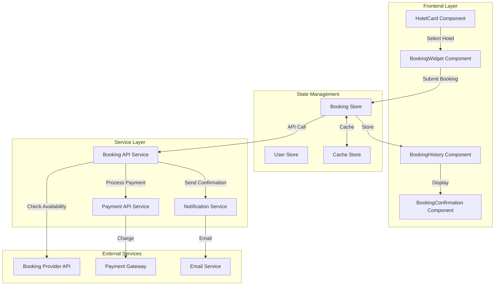

# Booking Integration Design Document

## Overview

The Booking Integration feature extends the Vagabond AI Navigator from a discovery platform to a complete booking solution. The design integrates seamlessly with the existing vibe-based hotel discovery system, maintaining the application's aesthetic and user experience while adding robust booking capabilities.

The architecture follows a modular approach with clear separation between UI components, business logic, and external service integrations. The design prioritizes user experience with optimistic UI updates, comprehensive error handling, and mobile-first responsive design.

### Key Design Principles

1. **Seamless Integration**: Booking flows emerge naturally from the existing hotel discovery experience
2. **Progressive Enhancement**: Core functionality works without authentication, enhanced features require login
3. **Optimistic UI**: Immediate feedback with background processing for better perceived performance
4. **Mobile-First**: Touch-optimized interfaces with responsive layouts
5. **Security by Design**: PCI-compliant payment handling with minimal sensitive data exposure

## Architecture

### High-Level Architecture



### Component Hierarchy

```
App
├── Index (Main Page)
│   ├── HotelGrid
│   │   └── HotelCard (Enhanced)
│   │       └── BookingButton
│   └── BookingModal
│       ├── DateSelector
│       ├── RoomSelector
│       ├── GuestInfoForm
│       ├── PricingSummary
│       └── PaymentForm
├── BookingConfirmation (New Page)
│   ├── ConfirmationDetails
│   ├── DownloadButton
│   └── ShareButton
└── Profile (New Page)
    └── BookingHistory
        ├── BookingList
        │   └── BookingCard
        └── BookingDetails
            ├── ModifyBooking
            └── CancelBooking
```

## Components and Interfaces

### 1. Enhanced HotelCard Component

**Purpose**: Add booking entry point to existing hotel cards

**New Props**:
```typescript
interface HotelCardProps {
  hotel: Hotel;
  index: number;
  onBookingClick?: (hotelId: number) => void; // New
}
```

**Changes**:
- Add "Book Now" button in card footer
- Display instant booking badge when available
- Show real-time availability indicator

### 2. BookingModal Component

**Purpose**: Main booking interface displayed as a modal overlay

**Props**:
```typescript
interface BookingModalProps {
  hotel: Hotel;
  isOpen: boolean;
  onClose: () => void;
  onBookingComplete: (booking: BookingConfirmation) => void;
}
```

**State**:
```typescript
interface BookingModalState {
  step: 'dates' | 'rooms' | 'guest-info' | 'payment' | 'processing';
  checkInDate: Date | null;
  checkOutDate: Date | null;
  selectedRoom: RoomOption | null;
  guestInfo: GuestInfo;
  availability: AvailabilityResponse | null;
  pricing: PricingDetails | null;
  isLoading: boolean;
  error: string | null;
}
```

**Sub-components**:

#### DateSelector
- Uses existing `Calendar` UI component
- Disables past dates and unavailable dates
- Shows pricing hints for different date ranges
- Mobile: Full-screen date picker
- Desktop: Inline calendar with range selection

#### RoomSelector
- Displays available room types with images
- Shows amenities, capacity, and pricing per room
- Allows quantity selection for group bookings
- Highlights best value options

#### GuestInfoForm
- Validates email, phone, and name fields
- Auto-fills from user profile if authenticated
- Supports special requests text area
- Mobile: One field per screen with smooth transitions

#### PricingSummary
- Sticky component visible throughout booking flow
- Line-item breakdown: base rate, taxes, fees, total
- Currency selector with real-time conversion
- Displays cancellation policy summary

#### PaymentForm
- Integrates with Stripe Elements or similar
- PCI-compliant iframe for card details
- Supports saved payment methods for authenticated users
- Shows security badges and SSL indicators

### 3. BookingConfirmation Component

**Purpose**: Display booking confirmation and provide post-booking actions

**Props**:
```typescript
interface BookingConfirmationProps {
  booking: BookingConfirmation;
}

interface BookingConfirmation {
  bookingId: string;
  referenceNumber: string;
  hotel: Hotel;
  checkInDate: string;
  checkOutDate: string;
  guestInfo: GuestInfo;
  roomDetails: RoomOption;
  pricing: PricingDetails;
  status: 'confirmed' | 'pending' | 'cancelled';
  confirmationSentAt: string;
}
```

**Features**:
- Animated success state with confetti effect
- QR code for mobile check-in
- Add to calendar button (iCal/Google Calendar)
- Download PDF confirmation
- Share booking via email/social
- Display hotel contact information
- Show directions/map to hotel

### 4. BookingHistory Component

**Purpose**: Manage user's past and upcoming bookings

**State**:
```typescript
interface BookingHistoryState {
  bookings: BookingConfirmation[];
  filter: 'all' | 'upcoming' | 'past' | 'cancelled';
  selectedBooking: BookingConfirmation | null;
  isLoading: boolean;
}
```

**Features**:
- Tabbed interface for filtering bookings
- Search by hotel name, location, or reference number
- Sort by date, price, or status
- Infinite scroll for large booking lists
- Pull-to-refresh on mobile

#### BookingCard
- Compact view showing key booking details
- Status badge (confirmed, pending, cancelled)
- Quick actions: view details, modify, cancel
- Countdown to check-in for upcoming bookings

#### BookingDetails
- Full booking information display
- Modification interface for eligible bookings
- Cancellation flow with policy display
- Re-booking option for cancelled reservations

### 5. ModifyBooking Component

**Purpose**: Allow users to change booking dates or room type

**Props**:
```typescript
interface ModifyBookingProps {
  booking: BookingConfirmation;
  onModificationComplete: (updatedBooking: BookingConfirmation) => void;
  onCancel: () => void;
}
```

**Features**:
- Check new availability for modified dates
- Calculate price difference (refund or additional charge)
- Display modification fees if applicable
- Confirm changes with updated confirmation

### 6. CancelBooking Component

**Purpose**: Handle booking cancellation with policy enforcement

**Props**:
```typescript
interface CancelBookingProps {
  booking: BookingConfirmation;
  onCancellationComplete: () => void;
  onCancel: () => void;
}
```

**Features**:
- Display cancellation policy clearly
- Calculate refund amount based on policy
- Require confirmation with reason selection
- Process refund through payment gateway
- Send cancellation confirmation email

## Data Models

### Hotel (Extended)

```typescript
interface Hotel {
  // Existing fields
  id: number;
  title: string;
  location: string;
  price: number;
  rating: number;
  reviews: number;
  image: string;
  amenities: string[];
  tags: string[];
  energy: number;
  social: number;
  budget: number;
  coordinates: number[];
  
  // New fields for booking
  instantBooking: boolean;
  cancellationPolicy: CancellationPolicy;
  checkInTime: string;
  checkOutTime: string;
  providerId: string;
  providerHotelId: string;
}
```

### RoomOption

```typescript
interface RoomOption {
  id: string;
  name: string;
  description: string;
  capacity: number;
  bedType: string;
  size: number; // square meters
  images: string[];
  amenities: string[];
  basePrice: number;
  available: number; // number of rooms available
  instantBooking: boolean;
}
```

### AvailabilityResponse

```typescript
interface AvailabilityResponse {
  hotelId: number;
  checkInDate: string;
  checkOutDate: string;
  available: boolean;
  rooms: RoomOption[];
  alternativeDates?: DateRange[];
  cachedAt: string;
  expiresAt: string;
}
```

### PricingDetails

```typescript
interface PricingDetails {
  baseRate: number;
  numberOfNights: number;
  subtotal: number;
  taxes: TaxBreakdown[];
  fees: FeeBreakdown[];
  total: number;
  currency: string;
  convertedTotal?: {
    amount: number;
    currency: string;
    rate: number;
  };
}

interface TaxBreakdown {
  name: string;
  amount: number;
  percentage?: number;
}

interface FeeBreakdown {
  name: string;
  amount: number;
  description: string;
}
```

### GuestInfo

```typescript
interface GuestInfo {
  firstName: string;
  lastName: string;
  email: string;
  phone: string;
  country: string;
  specialRequests?: string;
  arrivalTime?: string;
}
```

### CancellationPolicy

```typescript
interface CancellationPolicy {
  type: 'flexible' | 'moderate' | 'strict' | 'non-refundable';
  description: string;
  rules: CancellationRule[];
}

interface CancellationRule {
  daysBeforeCheckIn: number;
  refundPercentage: number;
  fee?: number;
}
```

### BookingRequest

```typescript
interface BookingRequest {
  hotelId: number;
  roomId: string;
  checkInDate: string;
  checkOutDate: string;
  guestInfo: GuestInfo;
  paymentMethodId: string;
  specialRequests?: string;
  userId?: string; // if authenticated
}
```

## Service Layer

### BookingAPIService

**Purpose**: Handle all booking-related API communications

```typescript
class BookingAPIService {
  private baseURL: string;
  private cache: CacheStore;
  
  async checkAvailability(
    hotelId: number,
    checkIn: Date,
    checkOut: Date
  ): Promise<AvailabilityResponse>;
  
  async getPricing(
    hotelId: number,
    roomId: string,
    checkIn: Date,
    checkOut: Date
  ): Promise<PricingDetails>;
  
  async createBooking(
    request: BookingRequest
  ): Promise<BookingConfirmation>;
  
  async getBooking(bookingId: string): Promise<BookingConfirmation>;
  
  async getUserBookings(userId: string): Promise<BookingConfirmation[]>;
  
  async modifyBooking(
    bookingId: string,
    modifications: Partial<BookingRequest>
  ): Promise<BookingConfirmation>;
  
  async cancelBooking(
    bookingId: string,
    reason?: string
  ): Promise<CancellationConfirmation>;
}
```

**Caching Strategy**:
- Availability: 5 minutes
- Pricing: 5 minutes
- Booking details: 1 hour
- User bookings list: 10 minutes
- Invalidate on booking creation/modification/cancellation

### PaymentAPIService

**Purpose**: Handle payment processing securely

```typescript
class PaymentAPIService {
  private stripeClient: Stripe;
  
  async createPaymentIntent(
    amount: number,
    currency: string,
    metadata: Record<string, string>
  ): Promise<PaymentIntent>;
  
  async confirmPayment(
    paymentIntentId: string,
    paymentMethodId: string
  ): Promise<PaymentConfirmation>;
  
  async processRefund(
    paymentIntentId: string,
    amount: number,
    reason: string
  ): Promise<RefundConfirmation>;
  
  async getSavedPaymentMethods(
    userId: string
  ): Promise<PaymentMethod[]>;
}
```

**Security Measures**:
- All payment data transmitted over HTTPS
- Use Stripe Elements for PCI compliance
- Never store complete card numbers
- Implement rate limiting (5 attempts per 10 minutes)
- Log all payment attempts for fraud detection

### NotificationService

**Purpose**: Handle email and push notifications

```typescript
class NotificationService {
  async sendBookingConfirmation(
    booking: BookingConfirmation,
    email: string
  ): Promise<void>;
  
  async sendModificationConfirmation(
    booking: BookingConfirmation,
    email: string
  ): Promise<void>;
  
  async sendCancellationConfirmation(
    booking: BookingConfirmation,
    refundAmount: number,
    email: string
  ): Promise<void>;
  
  async sendCheckInReminder(
    booking: BookingConfirmation,
    email: string
  ): Promise<void>;
  
  async sendPushNotification(
    userId: string,
    title: string,
    body: string,
    data?: Record<string, any>
  ): Promise<void>;
}
```

**Email Templates**:
- Booking confirmation with PDF attachment
- Modification confirmation
- Cancellation confirmation with refund details
- Check-in reminder (24 hours before)
- Hotel cancellation notification

## State Management

### Booking Store (Zustand)

```typescript
interface BookingStore {
  // State
  currentBooking: BookingModalState | null;
  bookingHistory: BookingConfirmation[];
  isLoading: boolean;
  error: string | null;
  
  // Actions
  startBooking: (hotel: Hotel) => void;
  updateBookingStep: (step: BookingModalState['step']) => void;
  setDates: (checkIn: Date, checkOut: Date) => void;
  selectRoom: (room: RoomOption) => void;
  setGuestInfo: (info: GuestInfo) => void;
  submitBooking: (paymentMethodId: string) => Promise<void>;
  cancelCurrentBooking: () => void;
  fetchBookingHistory: (userId: string) => Promise<void>;
  modifyBooking: (bookingId: string, modifications: any) => Promise<void>;
  cancelBooking: (bookingId: string, reason: string) => Promise<void>;
}
```

### Cache Store

```typescript
interface CacheStore {
  availability: Map<string, CachedData<AvailabilityResponse>>;
  pricing: Map<string, CachedData<PricingDetails>>;
  
  set: <T>(key: string, data: T, ttl: number) => void;
  get: <T>(key: string) => T | null;
  invalidate: (key: string) => void;
  clear: () => void;
}

interface CachedData<T> {
  data: T;
  cachedAt: number;
  expiresAt: number;
}
```

## API Integration

### Booking Provider Integration

**Provider Options**:
1. **Booking.com Affiliate API** (Primary)
2. **Expedia Partner Solutions** (Secondary)
3. **Amadeus Hotel API** (Tertiary)

**Integration Pattern**:
```typescript
interface BookingProviderAdapter {
  checkAvailability(params: AvailabilityParams): Promise<AvailabilityResponse>;
  getHotelDetails(hotelId: string): Promise<Hotel>;
  createReservation(request: BookingRequest): Promise<BookingConfirmation>;
  modifyReservation(bookingId: string, changes: any): Promise<BookingConfirmation>;
  cancelReservation(bookingId: string): Promise<CancellationConfirmation>;
}
```

**Adapter Implementation**:
- Create separate adapter for each provider
- Use factory pattern to select provider based on hotel
- Implement retry logic with exponential backoff
- Handle rate limiting with queue system
- Transform provider responses to internal data models

### Payment Gateway Integration

**Provider**: Stripe

**Integration Flow**:
1. Create Payment Intent on booking initiation
2. Collect payment details via Stripe Elements
3. Confirm payment on booking submission
4. Handle 3D Secure authentication if required
5. Process refunds for cancellations

**Webhook Handlers**:
- `payment_intent.succeeded`: Confirm booking
- `payment_intent.payment_failed`: Notify user, retry
- `charge.refunded`: Update booking status
- `charge.dispute.created`: Flag for review

## Error Handling

### Error Categories

1. **Validation Errors**
   - Invalid dates (past dates, check-out before check-in)
   - Missing required fields
   - Invalid email/phone format
   - Display inline with field highlighting

2. **Availability Errors**
   - Hotel not available for dates
   - Room sold out
   - Display alternative dates or similar hotels

3. **Payment Errors**
   - Card declined
   - Insufficient funds
   - 3D Secure failure
   - Display user-friendly message with retry option

4. **Network Errors**
   - API timeout
   - Connection lost
   - Display retry button with offline indicator

5. **System Errors**
   - Booking provider API down
   - Database error
   - Display apology message with support contact

### Error Recovery Strategies

```typescript
interface ErrorRecoveryStrategy {
  // Retry with exponential backoff
  retryWithBackoff: (fn: () => Promise<any>, maxRetries: number) => Promise<any>;
  
  // Fallback to alternative provider
  fallbackProvider: (primaryFn: () => Promise<any>, fallbackFn: () => Promise<any>) => Promise<any>;
  
  // Save state for later retry
  saveForRetry: (bookingRequest: BookingRequest) => void;
  
  // Notify support team
  notifySupport: (error: Error, context: any) => void;
}
```

### User-Facing Error Messages

```typescript
const ERROR_MESSAGES = {
  AVAILABILITY_CHECK_FAILED: "We're having trouble checking availability. Please try again.",
  BOOKING_FAILED: "We couldn't complete your booking. Your card has not been charged.",
  PAYMENT_DECLINED: "Your payment was declined. Please check your card details or try another card.",
  NETWORK_ERROR: "Connection lost. Please check your internet and try again.",
  HOTEL_UNAVAILABLE: "This hotel is no longer available for your dates. Here are similar options:",
  MODIFICATION_FAILED: "We couldn't modify your booking. Please contact support.",
  CANCELLATION_FAILED: "We couldn't cancel your booking. Please contact support immediately.",
};
```

## Testing Strategy

### Unit Tests

**Components**:
- DateSelector: Date validation, range selection
- RoomSelector: Room selection, quantity updates
- GuestInfoForm: Field validation, auto-fill
- PricingSummary: Price calculations, currency conversion
- PaymentForm: Stripe Elements integration

**Services**:
- BookingAPIService: API calls, caching, error handling
- PaymentAPIService: Payment intent creation, refunds
- NotificationService: Email sending, push notifications

**Utilities**:
- Date helpers: Date formatting, validation
- Price calculators: Tax/fee calculations
- Validators: Email, phone, card validation

### Integration Tests

**Booking Flow**:
1. Select hotel → Open booking modal
2. Select dates → Check availability
3. Select room → Get pricing
4. Enter guest info → Validate fields
5. Enter payment → Process payment
6. Receive confirmation → Display success

**Modification Flow**:
1. View booking → Load details
2. Request modification → Check new availability
3. Confirm changes → Process payment difference
4. Receive updated confirmation

**Cancellation Flow**:
1. View booking → Load details
2. Request cancellation → Display policy
3. Confirm cancellation → Process refund
4. Receive cancellation confirmation

### End-to-End Tests

**Critical Paths**:
- Complete booking flow from hotel selection to confirmation
- Booking modification with price increase
- Booking cancellation with refund
- Booking history viewing and filtering
- Mobile booking flow with touch interactions

**Test Scenarios**:
- Authenticated user booking
- Guest user booking (no account)
- Booking with saved payment method
- Booking with new payment method
- Booking with special requests
- Booking near check-in date
- Booking with instant confirmation
- Booking requiring manual confirmation

### Performance Tests

**Metrics**:
- Availability check: < 3 seconds
- Pricing calculation: < 2 seconds
- Booking submission: < 5 seconds
- Confirmation email: < 2 minutes
- Page load time: < 2 seconds
- Mobile interaction response: < 100ms

**Load Testing**:
- Concurrent bookings: 100 simultaneous users
- API rate limits: Respect provider limits
- Cache hit rate: > 70% for availability checks
- Database query time: < 100ms

## Mobile Responsiveness

### Breakpoints

```typescript
const BREAKPOINTS = {
  mobile: '320px - 767px',
  tablet: '768px - 1023px',
  desktop: '1024px+',
};
```

### Mobile-Specific Optimizations

**BookingModal**:
- Full-screen on mobile
- Bottom sheet for room selection
- Native date picker on iOS/Android
- Sticky "Continue" button at bottom
- Swipe gestures for step navigation

**DateSelector**:
- Large touch targets (min 44x44px)
- Month view with swipe navigation
- Quick date presets (Tonight, Tomorrow, This Weekend)

**PaymentForm**:
- Optimized keyboard types (email, tel, number)
- Auto-advance between fields
- Apple Pay / Google Pay integration
- Biometric authentication for saved cards

**BookingHistory**:
- Pull-to-refresh
- Infinite scroll
- Swipe actions (view, modify, cancel)
- Compact card view

### Touch Interactions

```typescript
// Swipe to navigate booking steps
const handleSwipe = (direction: 'left' | 'right') => {
  if (direction === 'left') nextStep();
  if (direction === 'right') previousStep();
};

// Long press for quick actions
const handleLongPress = (booking: BookingConfirmation) => {
  showQuickActions(['View', 'Modify', 'Cancel', 'Share']);
};
```

## Accessibility

### WCAG 2.1 AA Compliance

**Keyboard Navigation**:
- All interactive elements accessible via Tab
- Modal trapping focus within booking flow
- Escape key closes modals
- Arrow keys navigate date picker

**Screen Reader Support**:
- ARIA labels for all form fields
- ARIA live regions for dynamic content
- Descriptive button labels
- Status announcements for loading/errors

**Visual Accessibility**:
- Minimum contrast ratio 4.5:1
- Focus indicators on all interactive elements
- Text resizable up to 200%
- No information conveyed by color alone

**Form Accessibility**:
- Associated labels for all inputs
- Error messages linked to fields
- Required field indicators
- Helpful placeholder text

### Accessibility Testing

```typescript
// Example ARIA implementation
<button
  aria-label="Book The Serene Lakehouse from December 20 to December 25"
  aria-describedby="price-info"
  onClick={handleBooking}
>
  Book Now
</button>

<div id="price-info" className="sr-only">
  Total price $2,100 for 5 nights
</div>
```

## Performance Optimization

### Code Splitting

```typescript
// Lazy load booking components
const BookingModal = lazy(() => import('./components/BookingModal'));
const BookingHistory = lazy(() => import('./components/BookingHistory'));
const BookingConfirmation = lazy(() => import('./pages/BookingConfirmation'));
```

### Image Optimization

- Use WebP format with JPEG fallback
- Lazy load hotel images
- Responsive images with srcset
- Blur placeholder while loading

### API Optimization

- Debounce availability checks (500ms)
- Batch pricing requests
- Prefetch likely next steps
- Compress API responses (gzip)

### Caching Strategy

```typescript
// Service Worker for offline support
self.addEventListener('fetch', (event) => {
  if (event.request.url.includes('/api/bookings/')) {
    event.respondWith(
      caches.match(event.request).then((response) => {
        return response || fetch(event.request);
      })
    );
  }
});
```

## Security Considerations

### Data Protection

- Encrypt sensitive data at rest
- Use HTTPS for all communications
- Implement CORS policies
- Sanitize all user inputs
- Use parameterized queries

### Authentication

- JWT tokens for API authentication
- Refresh token rotation
- Session timeout after 30 minutes inactivity
- Secure cookie flags (HttpOnly, Secure, SameSite)

### Payment Security

- PCI DSS Level 1 compliance via Stripe
- No card data stored in application
- Tokenization for saved payment methods
- 3D Secure for high-value transactions
- Fraud detection via Stripe Radar

### Rate Limiting

```typescript
const RATE_LIMITS = {
  availabilityCheck: { requests: 20, window: '1m' },
  bookingCreation: { requests: 5, window: '10m' },
  bookingModification: { requests: 3, window: '1h' },
  bookingCancellation: { requests: 3, window: '1h' },
};
```

## Monitoring and Analytics

### Key Metrics

**Business Metrics**:
- Booking conversion rate
- Average booking value
- Cancellation rate
- Modification rate
- Time to booking completion

**Technical Metrics**:
- API response times
- Error rates by type
- Cache hit rates
- Payment success rate
- Email delivery rate

**User Experience Metrics**:
- Booking flow abandonment by step
- Mobile vs desktop conversion
- Time spent per step
- Form field errors
- Support ticket volume

### Analytics Events

```typescript
// Track booking funnel
analytics.track('Booking Started', { hotelId, source: 'hotel_card' });
analytics.track('Dates Selected', { checkIn, checkOut, nights });
analytics.track('Room Selected', { roomId, price });
analytics.track('Guest Info Completed', { hasAccount });
analytics.track('Payment Submitted', { paymentMethod });
analytics.track('Booking Completed', { bookingId, totalPrice, currency });

// Track errors
analytics.track('Booking Error', { step, errorType, errorMessage });
```

### Error Logging

```typescript
// Sentry integration
Sentry.captureException(error, {
  tags: {
    component: 'BookingModal',
    step: 'payment',
  },
  extra: {
    hotelId,
    bookingRequest,
    userId,
  },
});
```

## Future Enhancements

### Phase 2 Features

1. **Multi-room Booking**: Book multiple rooms in single transaction
2. **Group Booking**: Coordinate bookings for groups with shared itinerary
3. **Loyalty Integration**: Earn/redeem points from hotel loyalty programs
4. **Price Alerts**: Notify users when prices drop for saved hotels
5. **Flexible Dates**: "Book now, choose dates later" for flexible travelers

### Phase 3 Features

1. **Package Deals**: Bundle hotel with flights, activities
2. **Split Payment**: Share booking cost with travel companions
3. **Subscription Model**: Monthly fee for booking perks and discounts
4. **AI Concierge**: Chatbot for booking assistance and recommendations
5. **Blockchain Verification**: Immutable booking records on blockchain

## Migration Strategy

### Rollout Plan

**Phase 1: Soft Launch (Week 1-2)**
- Enable for 10% of users
- Monitor error rates and performance
- Gather user feedback
- Fix critical issues

**Phase 2: Gradual Rollout (Week 3-4)**
- Increase to 50% of users
- A/B test booking flow variations
- Optimize based on conversion data
- Expand to all hotel providers

**Phase 3: Full Launch (Week 5+)**
- Enable for 100% of users
- Announce feature via email/blog
- Monitor support tickets
- Iterate based on feedback

### Backward Compatibility

- Maintain existing hotel discovery functionality
- Booking features are additive, not replacing
- Graceful degradation if booking API unavailable
- Support both authenticated and guest bookings

## Dependencies

### External Services

- **Booking Provider API**: Booking.com, Expedia, or Amadeus
- **Payment Gateway**: Stripe
- **Email Service**: SendGrid or AWS SES
- **SMS Service**: Twilio (for booking confirmations)
- **Currency Conversion**: Open Exchange Rates API

### Internal Dependencies

- User authentication system (to be implemented)
- Profile management (to be implemented)
- Backend API infrastructure (to be implemented)

### Technical Dependencies

```json
{
  "dependencies": {
    "@stripe/stripe-js": "^2.0.0",
    "@stripe/react-stripe-js": "^2.0.0",
    "date-fns": "^3.6.0", // Already installed
    "react-hook-form": "^7.61.1", // Already installed
    "zod": "^3.25.76", // Already installed
    "axios": "^1.6.0",
    "react-query": "^5.83.0" // Already installed as @tanstack/react-query
  }
}
```

## Conclusion

This design provides a comprehensive blueprint for implementing booking integration into the Vagabond AI Navigator. The modular architecture ensures maintainability, the security measures protect user data, and the user experience design maintains the application's unique vibe-based discovery approach while adding powerful booking capabilities.

The design prioritizes mobile-first responsive design, accessibility, and performance, ensuring a seamless booking experience across all devices. The phased rollout strategy minimizes risk while gathering valuable user feedback for continuous improvement.
