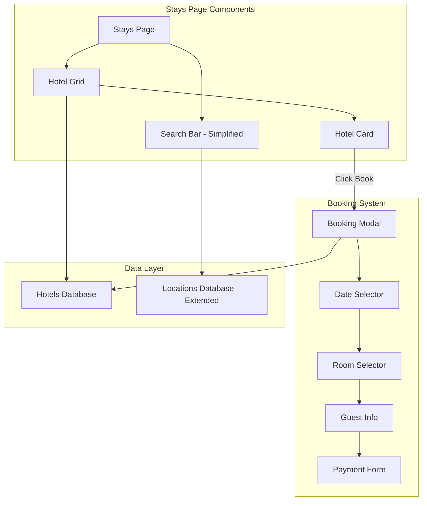
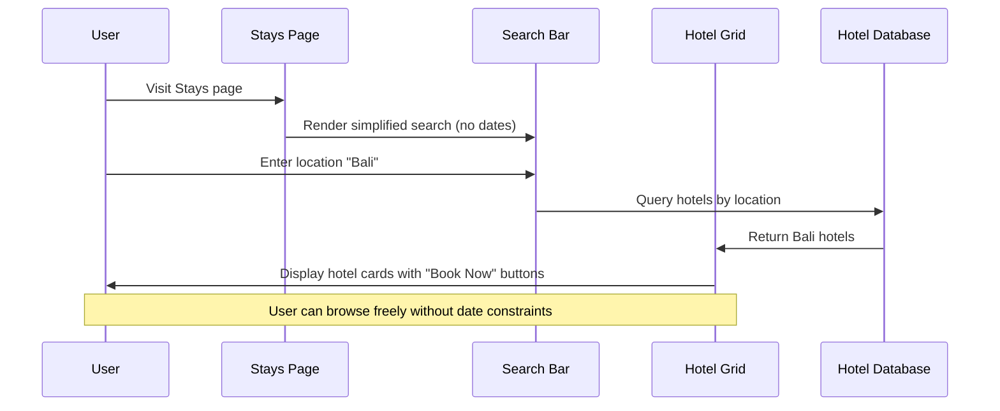
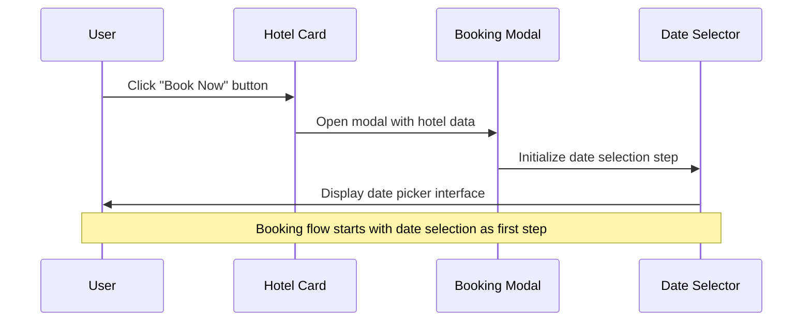
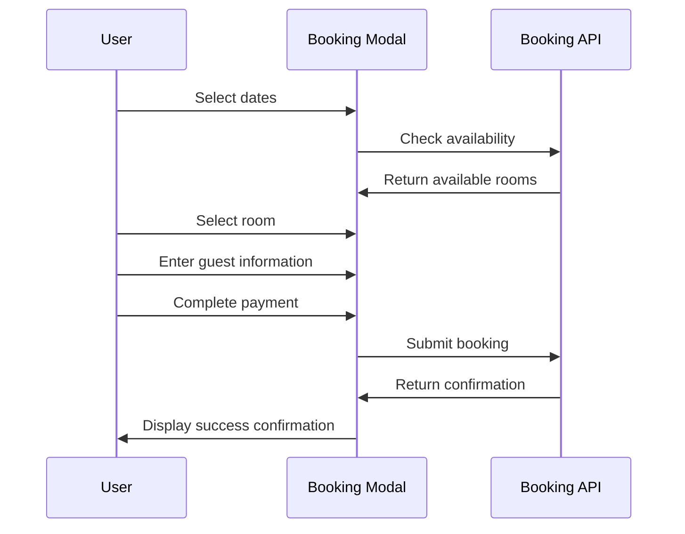

# Stays Booking Simplification Design Document

## Overview

This design simplifies the Stays page booking experience by removing date selection from the main search interface and leveraging the existing BookingModal popup system. The approach maintains the current booking flow while streamlining the initial hotel discovery process and expanding the available destinations.

### Key Design Principles

1. **Simplified Discovery**: Remove barriers to hotel browsing by eliminating required date selection upfront
2. **Preserve Existing Flow**: Maintain the proven BookingModal experience that users are familiar with
3. **Enhanced Destinations**: Expand location options to provide more travel choices
4. **Progressive Disclosure**: Show basic hotel information first, detailed booking requirements second

## Architecture

### Current vs. Proposed Flow

```mermaid
graph TB
    subgraph "Current Flow"
        A1[User visits Stays page] --> B1[Must select dates in search bar]
        B1 --> C1[Search for hotels with dates]
        C1 --> D1[View filtered results]
        D1 --> E1[Click Book button]
        E1 --> F1[BookingModal opens with dates pre-filled]
    end
    
    subgraph "Proposed Flow"
        A2[User visits Stays page] --> B2[Browse hotels without date requirement]
        B2 --> C2[Search by location/preferences only]
        C2 --> D2[View all available hotels]
        D2 --> E2[Click Book button]
        E2 --> F2[BookingModal opens starting with date selection]
    end
```



### Component Architecture



## Components and Interfaces

### 1. Simplified Search Bar

**Purpose**: Remove date selection fields while maintaining location and preference filtering

**Current Interface**:
```typescript
// Current search bar includes:
- Location input
- Check-in date picker
- Check-out date picker  
- Guest selector
- Search input
- Vibe filter button
```

**Proposed Interface**:
```typescript
interface SimplifiedSearchBarProps {
  location: string;
  onLocationChange: (location: string) => void;
  guests: string;
  onGuestsChange: (guests: string) => void;
  searchQuery: string;
  onSearchChange: (query: string) => void;
  onVibeFilterClick: () => void;
}

// Removed fields:
// - checkIn: string
// - onCheckInChange: (date: string) => void
// - checkOut: string  
// - onCheckOutChange: (date: string) => void
```

**Visual Changes**:
- Remove check-in and check-out date input fields
- Maintain location, guests, and search functionality
- Keep vibe filter button
- Adjust grid layout from 4 columns to 3 columns (location, guests, search)
- Maintain responsive design for mobile

### 2. Enhanced Location Database

**Purpose**: Expand available destinations to provide more travel options

**Current Locations** (from hotels.json analysis):
- Limited to approximately 8-10 locations
- Primarily focused on specific regions

**Proposed Location Expansion**:
```typescript
interface Destination {
  id: string;
  name: string;
  country: string;
  region: string;
  type: 'city' | 'beach' | 'mountain' | 'cultural' | 'adventure';
  coordinates: [number, number];
  timezone: string;
  currency: string;
}

const EXPANDED_DESTINATIONS: Destination[] = [
  // Major Cities
  { id: 'nyc', name: 'New York City', country: 'USA', region: 'North America', type: 'city' },
  { id: 'london', name: 'London', country: 'UK', region: 'Europe', type: 'city' },
  { id: 'tokyo', name: 'Tokyo', country: 'Japan', region: 'Asia', type: 'city' },
  { id: 'paris', name: 'Paris', country: 'France', region: 'Europe', type: 'city' },
  { id: 'sydney', name: 'Sydney', country: 'Australia', region: 'Oceania', type: 'city' },
  
  // Beach Destinations
  { id: 'maldives', name: 'Maldives', country: 'Maldives', region: 'Asia', type: 'beach' },
  { id: 'santorini', name: 'Santorini', country: 'Greece', region: 'Europe', type: 'beach' },
  { id: 'bali', name: 'Bali', country: 'Indonesia', region: 'Asia', type: 'beach' },
  { id: 'miami', name: 'Miami', country: 'USA', region: 'North America', type: 'beach' },
  { id: 'cancun', name: 'Cancun', country: 'Mexico', region: 'North America', type: 'beach' },
  
  // Mountain Destinations
  { id: 'aspen', name: 'Aspen', country: 'USA', region: 'North America', type: 'mountain' },
  { id: 'chamonix', name: 'Chamonix', country: 'France', region: 'Europe', type: 'mountain' },
  { id: 'banff', name: 'Banff', country: 'Canada', region: 'North America', type: 'mountain' },
  { id: 'zermatt', name: 'Zermatt', country: 'Switzerland', region: 'Europe', type: 'mountain' },
  
  // Cultural Destinations
  { id: 'rome', name: 'Rome', country: 'Italy', region: 'Europe', type: 'cultural' },
  { id: 'kyoto', name: 'Kyoto', country: 'Japan', region: 'Asia', type: 'cultural' },
  { id: 'marrakech', name: 'Marrakech', country: 'Morocco', region: 'Africa', type: 'cultural' },
  { id: 'istanbul', name: 'Istanbul', country: 'Turkey', region: 'Europe', type: 'cultural' },
  
  // Adventure Destinations
  { id: 'queenstown', name: 'Queenstown', country: 'New Zealand', region: 'Oceania', type: 'adventure' },
  { id: 'reykjavik', name: 'Reykjavik', country: 'Iceland', region: 'Europe', type: 'adventure' },
  { id: 'capetown', name: 'Cape Town', country: 'South Africa', region: 'Africa', type: 'adventure' },
];
```

### 3. Extended Hotel Database

**Purpose**: Add hotels for new destinations while maintaining existing data structure

**Hotel Data Structure** (maintain compatibility):
```typescript
interface Hotel {
  id: number;
  title: string;
  location: string; // Updated to include new destinations
  price: number;
  rating: number;
  reviews: number;
  image: string;
  amenities: string[];
  tags: string[];
  energy: number;
  social: number;
  budget: number;
  coordinates: number[];
  instantBooking?: boolean; // For booking integration
  cancellationPolicy?: CancellationPolicy;
}
```

**New Hotels Distribution**:
- Minimum 3-5 hotels per new destination
- Maintain variety in price ranges (budget: 1-3, mid-range: 4-6, luxury: 7-10)
- Ensure diverse energy/social/budget vibe scores
- Include mix of instant booking and standard booking options

### 4. Booking Modal Integration

**Purpose**: Ensure seamless integration with existing BookingModal without changes

**No Changes Required**:
- BookingModal component remains unchanged
- Date selection step continues to be the first step
- All existing functionality preserved (rooms, guest info, payment)
- Modal opening trigger remains the same (hotel card booking button)

**Integration Points**:
```typescript
// HotelGrid.tsx - No changes to booking trigger
const handleBookingClick = (hotelId: number) => {
  setSelectedHotelId(hotelId);
  setIsBookingModalOpen(true);
};

// BookingModal.tsx - No changes required
// Modal will continue to start with date selection step
// All existing steps and functionality preserved
```

## Data Models

### 1. Updated Stays Page State

```typescript
interface StaysPageState {
  // Removed date-related state
  // checkIn: string;
  // checkOut: string;
  
  // Maintained state
  searchQuery: string;
  location: string;
  guests: string;
  isVibeOpen: boolean;
  isMapOpen: boolean;
  instantBookingOnly: boolean;
  
  // Vibe sliders
  energy: number;
  social: number;
  budget: number;
  
  // Modal states
  selectedEcho: Echo | null;
  isEchoModalOpen: boolean;
}
```

### 2. Enhanced Location Data

```typescript
interface LocationData {
  destinations: Destination[];
  hotels: Hotel[];
  
  // Helper methods
  getHotelsByLocation: (location: string) => Hotel[];
  getDestinationsByType: (type: DestinationType) => Destination[];
  searchDestinations: (query: string) => Destination[];
}
```

## User Experience Flow

### 1. Hotel Discovery Flow



### 2. Booking Initiation Flow



### 3. Complete Booking Flow



## Implementation Strategy

### Phase 1: Search Bar Simplification

**Changes Required**:
1. Remove date input fields from Stays.tsx search bar
2. Update grid layout from 4 columns to 3 columns
3. Remove date-related state variables
4. Update filtering logic to exclude date-based filtering

**Files to Modify**:
- `src/pages/Stays.tsx` - Remove date inputs and state
- Update responsive design for 3-column layout

### Phase 2: Location Database Expansion

**Changes Required**:
1. Extend hotels.json with new destinations and hotels
2. Add minimum 3-5 hotels per new destination
3. Ensure proper vibe score distribution
4. Maintain existing data structure compatibility

**Files to Modify**:
- `src/data/hotels.json` - Add new hotel entries
- Ensure proper image URLs and amenities for new hotels

### Phase 3: Testing and Validation

**Validation Points**:
1. Verify BookingModal opens correctly from all hotel cards
2. Confirm date selection works as first step in modal
3. Test location filtering with new destinations
4. Validate responsive design on mobile devices
5. Ensure vibe filtering works with expanded hotel database

## Mobile Responsiveness

### Search Bar Layout

**Desktop (3 columns)**:
```
[Location Input] [Guest Selector] [Search Input + Vibe Button]
```

**Tablet (2 rows)**:
```
[Location Input] [Guest Selector]
[Search Input + Vibe Button]
```

**Mobile (Stacked)**:
```
[Location Input]
[Guest Selector]  
[Search Input]
[Vibe Button]
```

### Hotel Grid Responsiveness

- Maintain existing responsive grid: 1 column (mobile), 2 columns (tablet), 3 columns (desktop)
- Ensure booking buttons remain accessible on all screen sizes
- Preserve existing touch interactions and swipe gestures

## Performance Considerations

### Data Loading

**Hotel Database**:
- Expanded hotel database will increase initial load size
- Consider lazy loading hotels by region if performance impacts occur
- Maintain client-side filtering for responsive search experience

**Image Optimization**:
- Ensure new hotel images are optimized for web delivery
- Use appropriate image formats (WebP with JPEG fallback)
- Implement lazy loading for hotel images

### Search Performance

**Location Filtering**:
- Client-side filtering should remain performant with expanded dataset
- Consider implementing search debouncing if needed
- Maintain fast vibe-based filtering algorithms

## Accessibility

### Search Interface

**Keyboard Navigation**:
- Maintain tab order through simplified search fields
- Ensure all interactive elements are keyboard accessible
- Preserve existing ARIA labels and descriptions

**Screen Reader Support**:
- Update search form labels to reflect removed date fields
- Maintain descriptive text for location and guest inputs
- Ensure booking buttons have clear, descriptive labels

### Booking Modal

**No Changes Required**:
- Existing BookingModal accessibility features remain unchanged
- Date selection step maintains existing keyboard navigation
- All ARIA labels and screen reader support preserved

## Error Handling

### Location Search

**Invalid Locations**:
- Display helpful error messages for unrecognized locations
- Suggest similar or nearby destinations
- Provide fallback to show all available destinations

**No Results**:
- Show clear "no hotels found" messaging
- Suggest alternative locations or adjusting vibe preferences
- Provide easy way to clear filters and start over

### Booking Integration

**Modal Opening**:
- Handle cases where hotel data is incomplete
- Provide fallback error messaging if booking modal fails to open
- Ensure graceful degradation if booking system is unavailable

## Testing Strategy

### Unit Tests

**Search Functionality**:
- Test location filtering with new destinations
- Verify guest selector functionality
- Validate vibe filtering with expanded hotel database

**Component Integration**:
- Test hotel card booking button functionality
- Verify modal opening with correct hotel data
- Validate responsive layout changes

### Integration Tests

**Booking Flow**:
- Test complete flow from hotel selection to booking modal
- Verify date selection works as first step in modal
- Validate booking completion process

**Data Integration**:
- Test filtering with expanded hotel database
- Verify location search with new destinations
- Validate vibe matching algorithms with larger dataset

### User Acceptance Testing

**Usability Testing**:
- Verify users can easily discover hotels without date selection
- Test booking flow feels natural and intuitive
- Validate mobile experience remains smooth and responsive

**Performance Testing**:
- Ensure page load times remain acceptable with expanded data
- Test search responsiveness with larger hotel database
- Validate smooth scrolling and interactions

## Migration Strategy

### Rollout Plan

**Phase 1: Backend Preparation**
- Extend hotel database with new destinations
- Validate data integrity and completeness
- Test performance with expanded dataset

**Phase 2: Frontend Updates**
- Implement search bar simplification
- Update responsive layouts
- Test booking modal integration

**Phase 3: User Testing**
- Deploy to staging environment
- Conduct user acceptance testing
- Gather feedback and iterate

**Phase 4: Production Deployment**
- Deploy simplified search interface
- Monitor user behavior and conversion rates
- Collect feedback for future improvements

### Rollback Strategy

**Quick Rollback**:
- Maintain ability to restore date fields if needed
- Keep original hotel database as backup
- Preserve existing booking modal functionality

**Data Rollback**:
- Ability to revert to original hotel dataset
- Maintain compatibility with existing booking system
- Preserve user preferences and vibe settings

## Success Metrics

### User Engagement

**Discovery Metrics**:
- Increased hotel browsing time
- Higher number of hotels viewed per session
- Reduced bounce rate from search interface

**Booking Metrics**:
- Booking conversion rate (hotel view to booking completion)
- Time to booking completion
- Booking abandonment rate by step

### Technical Metrics

**Performance**:
- Page load time with expanded hotel database
- Search response time
- Mobile performance scores

**Error Rates**:
- Booking modal opening success rate
- Search error frequency
- Mobile interaction error rates

## Future Enhancements

### Advanced Search Features

**Smart Recommendations**:
- AI-powered destination suggestions based on user preferences
- Seasonal recommendations based on travel dates (when selected in modal)
- Personalized hotel recommendations based on booking history

**Enhanced Filtering**:
- Price range filtering
- Amenity-based filtering
- Distance-based filtering from landmarks

### Booking Experience

**Quick Booking**:
- Save user preferences for faster rebooking
- One-click booking for returning users
- Wishlist functionality for future bookings

**Social Features**:
- Share hotel discoveries with friends
- Group booking coordination
- Travel companion recommendations

## Conclusion

This design maintains the proven BookingModal experience while simplifying the initial hotel discovery process. By removing date selection barriers and expanding destination options, users can more freely explore accommodations before committing to specific travel dates. The approach preserves all existing functionality while improving the user experience through progressive disclosure of booking requirements.

The implementation strategy minimizes risk by maintaining existing components and data structures while making targeted improvements to the search interface and destination database. The expanded location options provide users with significantly more travel choices while maintaining the unique vibe-based discovery approach that differentiates the platform.